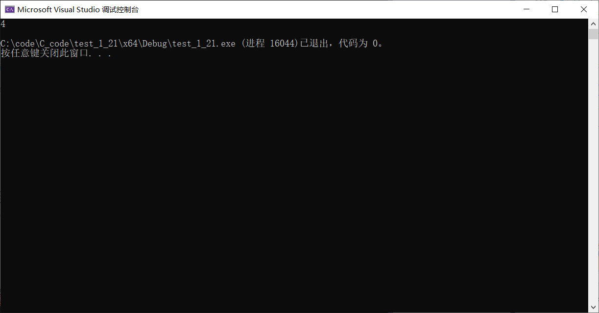
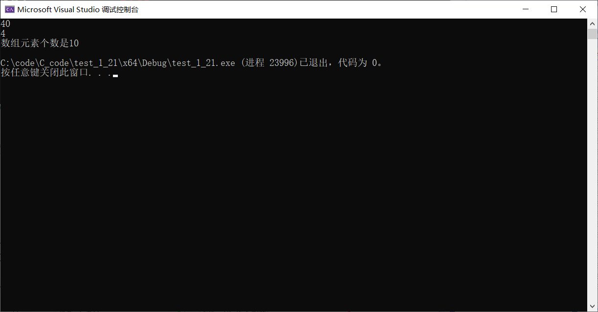
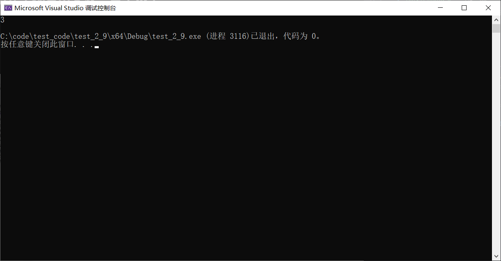
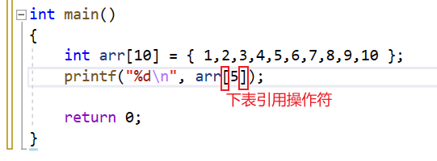
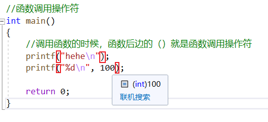

# 操作符

-----

## 算术操作符

`+ - * / %`

```C{.line-numbers}
int main()
{
    int a = 9 / 2;
    float b = 9 / 2;
    float c = 9 / 2.0;
    printf("%d\n", a);
    printf("%f\n", b);
    printf("%f\n", c);//只有操作数中有小数才能得出4.5，否则即使是%f,也只能输出4.000

    int d = 9 % 2;//% - 取模（余）
    printf("%d\n", d);

    return 0;
}
```

运行结果


## 移位操作符

`>> <<`

```C{.line-numbers}
int main()
{
    int a = 2;
    int b = a << 1;//左移操作符 -- 移动的是二进制位
    printf("%d\n", b);

    return 0;
}
```

运行结果


## 位操作符

```C
&  按位与

|  按位或

^  按位异或

```

## 赋值操作符

```c
= += -= *= /= &= ^= |= >>= <<=
```

演示实例

```C{.line-numbers}
int main()
    {
    int a = 2;
    a = a + 5;
    a += 5;

    a = a - 3;
    a -= 3;

    a = a % 3;
    a %= 3;

    printf("%d\n", a);

    return 0;
}
```

运行结果


## 单目操作符

只有一个操作数

```c
!       逻辑反操作
-       负值
+       正值
&       取地址
sizeof  操作数的类型长度（以字节为单位）
~       对一个数的二进制按位取反
--      前置、后置--
++      前置、后置++
*       间接访问操作符(解引用操作符)
(类型)  强制类型转换

```

演示代码

```C{.line-numbers}
int main()
{
    //0表示假，非0就是真
    int a = 0;
    printf("%d\n", !a);//1

    if (a)
    {
    //如果a为真，执行
    }
    if (!a)
    {
    //如果a为假，执行
    }
    a = -5;
    a = -a;
    a = +a;

    return 0;
}
```

### sizeof是一个操作符，可以计算类型或变量大小

```C{.line-numbers}
int main()
{
    //seizeof是一个操作符
    //sizeof不是函数
    //计算类型或变量大小的
    int a = 10;
    printf("%d\n", sizeof(int));
    printf("%d\n", sizeof(a));

    return 0;
}
```

### 也可以计算数组大小

```C{.line-numbers}
int main()
{
    //10*4=40
    int arr[10] = { 0 };
    printf("%d\n", sizeof(arr));//计算的是数组总大小，单位是字节
    printf("%d\n", sizeof(arr[0]));//数组中单个元素的大小
    int sz = sizeof(arr) / sizeof(arr[0]);//计算数组个数
    printf("数组元素个数是%d\n", sz);

    return 0;
}
```

运行结果


### ~ 按（二进制）位取反

```C{}
把所有二进制位中数字，1变0,0变1
```

对于负数来说

```c
整数a=0
二进制：
00000000 00000000 00000000 00000000
11111111 11111111 11111111 11111111 ~a
整数在内存中存储的是补码
一个整数的二进制表示有3种
-1：
原码 10000000 00000000 00000000 00000001//最高位是符号位
反码 11111111 11111111
11111111 11111110//除符号位全部取反
补码 11111111 11111111
11111111 11111110//反码二进制序列加1
```

_**正整数：原码，反码，补码，相同**_  

### 前置++，先++，后使用

代码实例

```C{.line-numnbers}
//前置++
int main()
{
    int a = 10;
    int b = ++a;//前置++  先++，后使用
    printf("%d\n", b);//11
    printf("%d\n", a);//11

    return 0;
}
```

### 后置++,先使用，后++

```C{.line-numnbers}
//后置++
int main()
{
    int a = 10;
    int b = a++;//后置++,先使用，后++
    printf("%d\n", b);//10
    printf("%d\n", a);//11

    return 0;
}
```

### 强制类型转换

```C{.line-numbers}
int main()
{
    //强制类型转换
    int a = (int)3.14;
    printf("%d\n", a);

    return 0;
}
```

## 关系操作符

```C
>
>=
<
<=
!= 用于测试“不相等”
== 用于测试“相等”
```

## 逻辑操作符

```C
&& 逻辑与
|| 逻辑或
```

## 条件操作符(三目操作符)

```C
exp1 ? exp2 : exp3
//exp1成立，exp2计算，整个表达式的结果是exp2
//exp1不成立，exp3计算，整个表达式的结果是exp3
```

代码实例

```c
int main()
{
    int a = 0;
    int b = 3;
    int max = 0;

    //if (a > b)
    //{
    // max = a;
    //}
    //else {
    // max = b;
    //}

    max = a > b ? a : b;
    printf("%d\n", max);

    return 0;
}
```

## 逗号表达式

```C
exp1, exp2, exp3, …expN
```

代码实例

```c
int main()
{
    int a = 0;
    int b = 3;
    int c = 5;

    int d = (a = b + 2, c = a - 4, b = c + 2);
    //逗号表达式，是从左向右以此计算的
    //整个表达式的结果是最后一个表达式的结果
    printf("%d\n", d);

    return 0;
}
```

运行结果


## 下标引用、函数调用和结构成员

```C
[] () . ->
```

下标引用操作符


函数调用操作符

