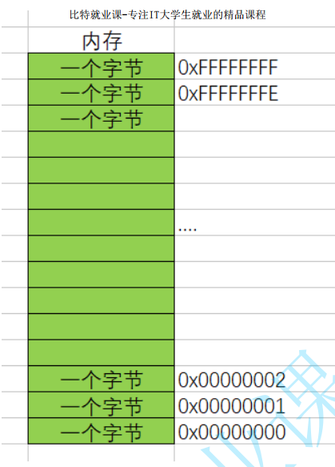
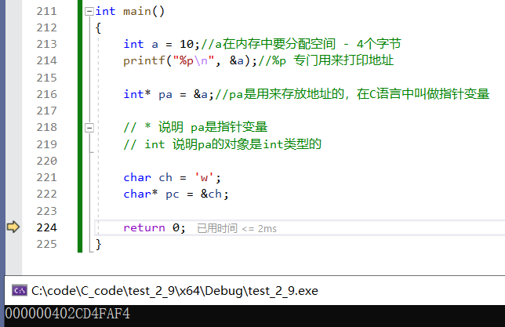
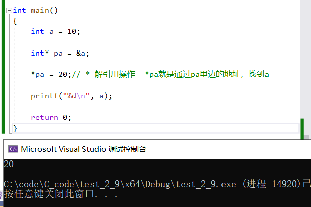

# 指针

---

## 内存

内存是电脑上特别重要的存储器，计算机中程序的运行都是在内存中进行的 。
所以为了有效的使用内存，就把内存划分成一个个小的内存单元，**每个内存单元的大小是1个字节**。
为了能够有效的访问到内存的每个单元，就给内存单元进行了编号，这些**编号被称为该内存单元的地
址**



### 注 %p 专门用来打印地址

### 对应代码演示

```C{.line-numbers}
int main()
{
    int a = 10;//a在内存中要分配空间 - 4个字节
    printf("%p\n", &a);//%p 专门用来打印地址

    int* pa = &a;//pa是用来存放地址的，在C语言中叫做指针变量

    // * 说明 pa是指针变量
    // int 说明pa的对象是int类型的

    char ch = 'w';
    char* pc = &ch;

    return 0;
}
```



### 可通过指针修改变量值

  *是解引用操作

```C{.line-numbers}
int main()
{
    int a = 10;

    int* pa = &a;

    *pa = 20;// * 解引用操作  *pa就是通过pa里边的地址，找到a

    printf("%d\n", a);

    return 0;
}
```

演示


## 指针变量的大小

指针的大小是相同的！
为什么呢？
指针是用来存放在地址的！
指针需要多大空间，取决于地址的存储需要多大空间

32位 32bit - 4byte
64位 64bit - 8byte 

