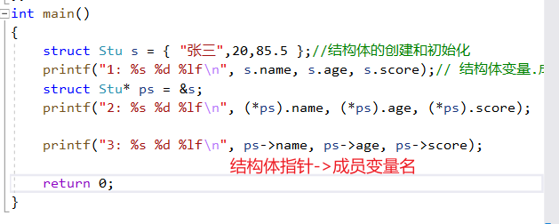

# 初始结构体

---------

结构体是C语言中特别重要的知识点，结构体使得C语言有能力描述复杂类型。
比如描述学生，学生包含： `名字+年龄+性别+学号` 这几项信息。
这里只能使用结构体来描述了。

## 代码

```C{.line-numbers}
//结构体可以让C语言创建新的类型出来

//创建一个学生

struct Stu
{
    char name[20];//成员变量
    int age;
    double score;
    };

    //创建一个书的类型
    struct Book
    {
    char name[20];
    float price;
    char id[30];
    };
    int main()
    {
    struct Stu s = { "张三",20,85.5 };//结构体的创建和初始化
    printf("1: %s %d %lf\n", s.name, s.age, s.score);// 结构体变量.成员变量
    struct Stu* ps = &s;
    printf("2: %s %d %lf\n", (*ps).name, (*ps).age, (*ps).score);

    printf("3: %s %d %lf\n", ps->name, ps->age, ps->score);

    return 0;
}
```

