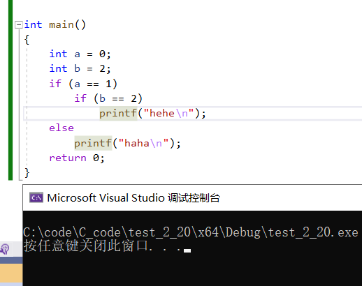

# if 语句

------

if语句的语法结构是什么样的呢？

```C
语法结构：
if(表达式)
    语句;

if(表达式)
    语句1;
else
    语句2;

//多分支
if(表达式1)
    语句1;
else if(表达式2)
    语句2;
else
    语句3;
```

演示代码

```C
语法结构：
if(表达式)
    语句;

if(表达式)
    语句1;
else
    语句2;

//多分支
if(表达式1)
    语句1;
else if(表达式2)
    语句2;
else
    语句3;
```

1.1 演示代码

```C
int main()
{
    int age = 70;

    //多分支
    if (age < 18)
    {
    printf("少年\n");
    }
    else if (age >= 18 && age < 26) {
    printf("青年\n");
    }
    else if (age >= 26 && age < 40) {
    printf("中年\n");
    }
    else if (age >= 40 && age < 60) {
    printf("壮年\n");
    }
    else if (age >= 60 && age <= 100) {
    printf("老年\n");
    }
    else {
    printf("老不死\n");
    }

    /*if (age < 18)
    {
    printf("少年\n");
    }
    else if (18 <= age < 26) {
    printf("青年\n");
    }*/ //错误写法


    /*if (age >= 18)
    {
    printf("成年\n");
    }
    else {
    printf("未成年\n");
    }*/


    /*if (age >= 18)
    {
    printf("成年\n");
    }*/

    return 0;
}
```

## 1.1.1 悬空else

```C
int main()
{
    int a = 0;
    int b = 2;
    if (a == 1)
        if (b == 2)
            printf("hehe\n");
    else
        printf("haha\n");
    return 0;
}
```


**else的匹配：else是和它离的最近的if匹配的**

## 1.1.2 if书写形式的对比

```C
//代码1
if (condition) {
    return x;
}
return y;
//代码2
if(condition)
{
    return x;
}
else
{
    return y;
}
//代码3
int num = 1;
if(num == 5)
{
    printf("hehe\n");
}
//代码4
int num = 1;
if(5 == num)
{
    printf("hehe\n");
}
```

**代码2和代码4更好，逻辑更加清晰，不容易出错。**

## 1.1.3 练习

1. 判断一个数是否为奇数
2. 输出1-100之间的奇数

```C
//1.判断一个数是否为奇数
int main()
{
    int num = 15;
    if (num % 2 == 1)
    {
    printf("奇数\n");
    }

    return 0;
}
```

```C
//2.输出1-100之间的奇数
int main()
{
    int num = 1;
    for (num = 1; num <= 100; num++)
    {
        if (num % 2 == 1)
        {
            printf("%d ", num);
        }
    }

    return 0;
}
```
