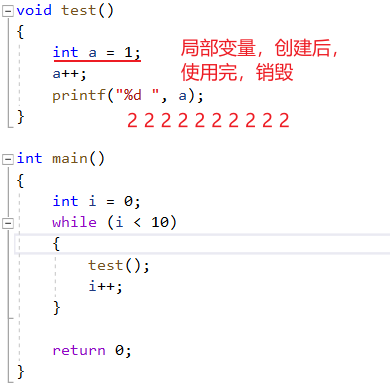
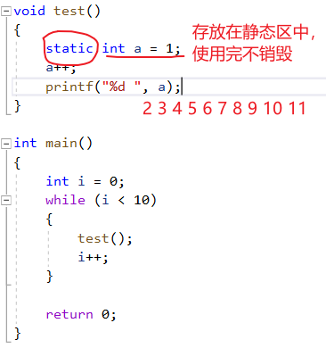
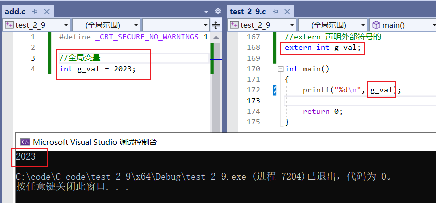
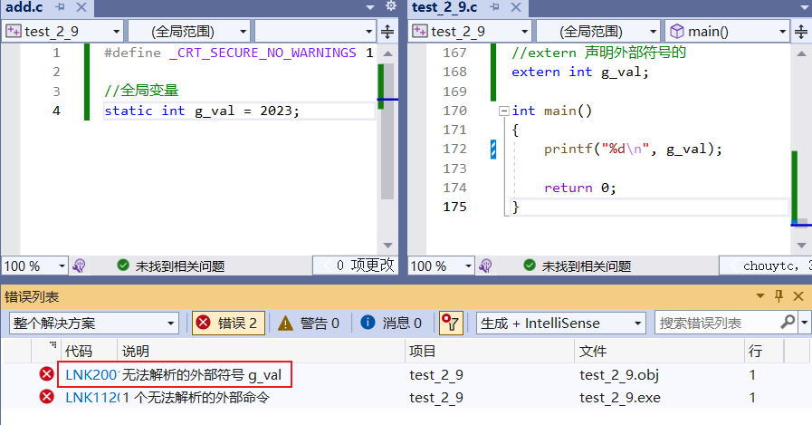
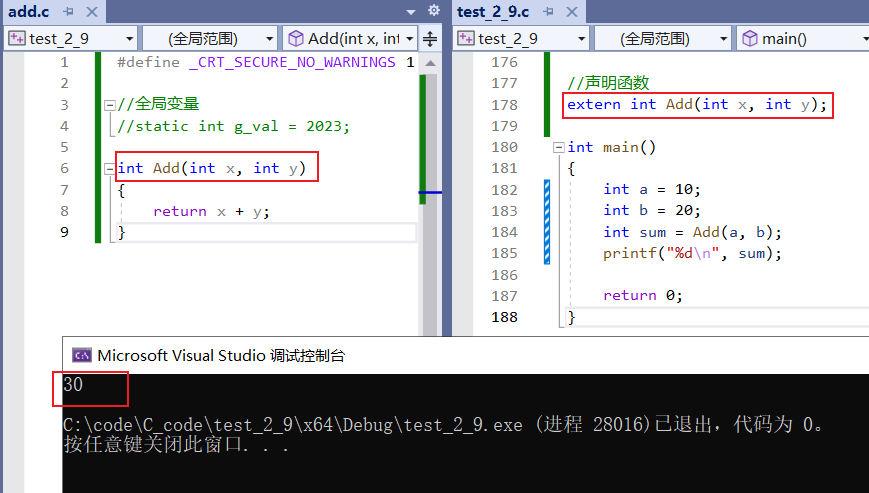
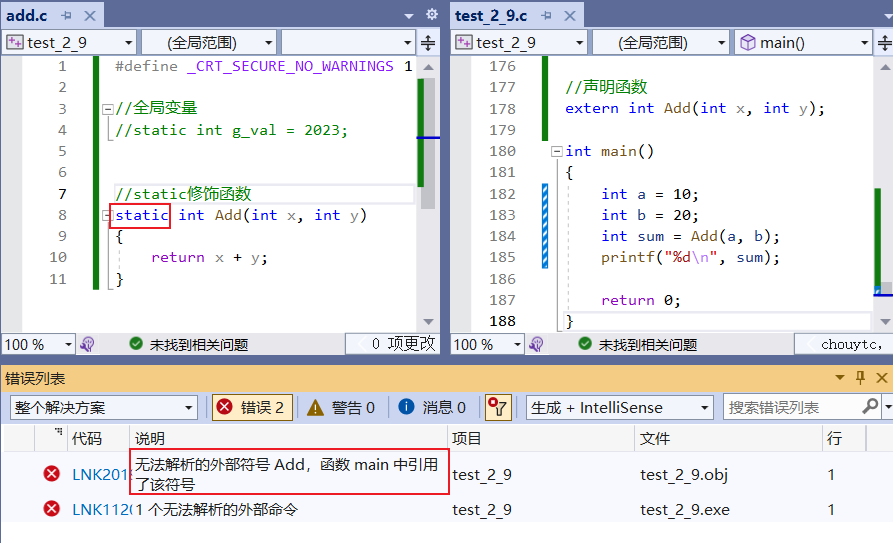

# 初始关键字

---

## static

### static修饰局部变量

static修饰局部变量，改变了局部变量的生命周期（本质上改变了变量的存储类型）

### static修饰全局变量

全局变量在整个工程中都能使用

static 修饰全局变量：使得这个全局变量只能在自己所在的源文件（.c）内部可以使用，其它源文件不能使用

全局变量，在其他源文件内部可以被使用，是因为全局变量具有外部链接属性，但是在被static修饰后，就变成内部链接属性，其它源文件就不能链接到这个静态的全局变量了！

### static修饰函数

static修饰函数，使得函数只能在自己所在的源文件内部使用，不能在其他源文件内部使用

本质上：static是将函数的**外部链接属性变成了内部链接属性**！（和static修饰，全局变量一样！）

