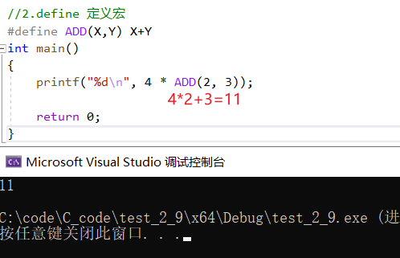

# 常量和宏

-----

## define定义符号

```C{.line-numbers}
#define MAX 100

int main()
{
    printf("%d\n", MAX);

    return 0;
}
```

## define 定义宏

```C{.line-numbers}
#define ADD(X,Y) X+Y
int main()
{
    printf("%d\n", 4 * ADD(2, 3));

    return 0;
}
```


