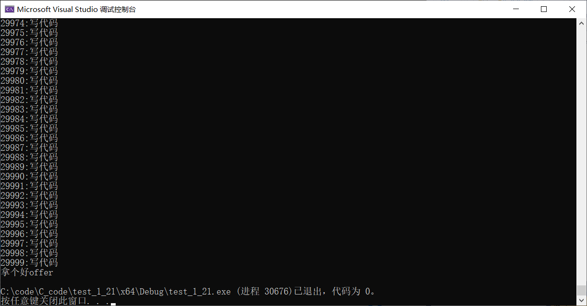

# 初识循环语句

------
加入比特，只有写够30000行有效代码，才能找个好工作！

如何用while实现上述流程呢
如下：

~~~C{.line-numbers}
int main()
{
    int line = 0;
    while (line < 30000)
    {
    printf("%d:写代码\n", line);
    line++;
    }
    if (line == 30000)
    {
    printf("拿个好offer\n");
    }

    return 0;
}
~~~

运行结果如下

C语言中还有其他实现循环的方法吗？

- while语句
- for语句（后期讲）
- do...while语句（后期讲）
