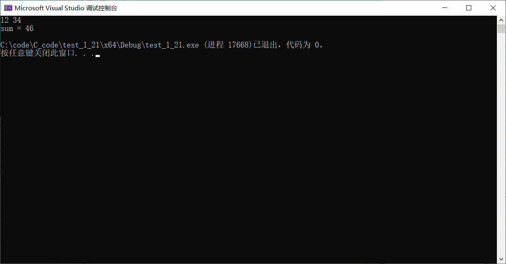
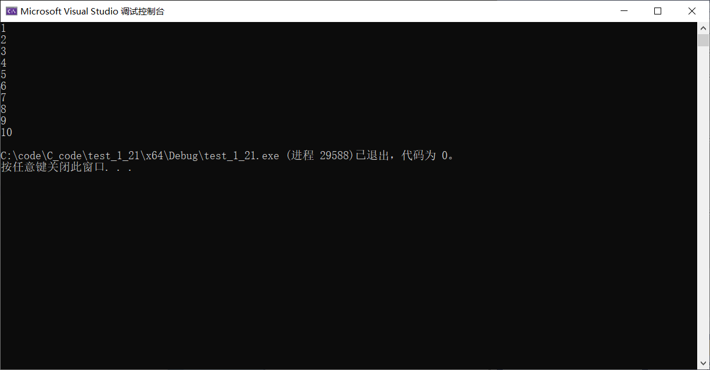

# 初识函数&&数组

--------

## 函数

数学里就学过函数
例如：
$$
f(x)=2x+5
$$
C语言里的函数也是一样的
$$
f(x,y)=x+y  
$$
$$
Add(x,y)=x+y
$$
不利用函数实现两个数想加

~~~C{.line-numbers}
int main()
{
    int num1 = 0;
    int num2 = 0;
    scanf("%d%d", &num1, &num2);
    int sum = num1 + num2;
    printf("sum = %d\n", sum);

    return 0;
}
~~~

演示实例

利用函数求两数之和

~~~C{.line-numbers}
//利用函数算两数之和
int Add(int x, int y)
{
    int z = 0;
    z = x + y;
    return z;
}
    int main()
{
    int num1 = 0;
    int num2 = 0;
    scanf("%d%d", &num1, &num2);
    Add(num1, num2);
    int sum = Add(num1, num2);
    printf("sum = %d\n", sum);

    return 0;
}
~~~

演示实例

## 数组

如果需要存1~10的数字，该如何存储？用数组来存储

### 数组的定义

数组：一组相同类型元素的集合

~~~C
int arr[10] = {1,2,3,4,5,6,7,8,9,10};//定义一个整形数组，最多放10个元素
~~~

### 数组的下标

~~~C
int arr[10] = {1,2,3,4,5,6,7,8,9,10};//10个元素，下标0~9
~~~

|arr[10]|1|2|3|4|5|6|7|8|9|10|
|-|-|-|-|-|-|-|-|-|-|-|
|下标|0|1|2|3|4|5|6|7|8|9|
数组是通过下标来访问的
例如

~~~C
int main()
{
    //int a = 1;
    //int b = 2;
    //int c = 3;
    //....如果用10个变量一次存储，非常不便

    //数组 - 一组相同类型的元素的集合
    //10个整形1~10存起来
    //数组使用下标来访问的

    int arr[10] = { 1,2,3,4,5,6,7,8,9,10 };
    int i = 0;
    while (i < 10)
    {
    printf("%d\n", arr[i]);
    i++;
    }
    //char ch[5] = { 'a','b','c' };//不完全初始化，剩余默认为0

    return 0;
}
~~~
